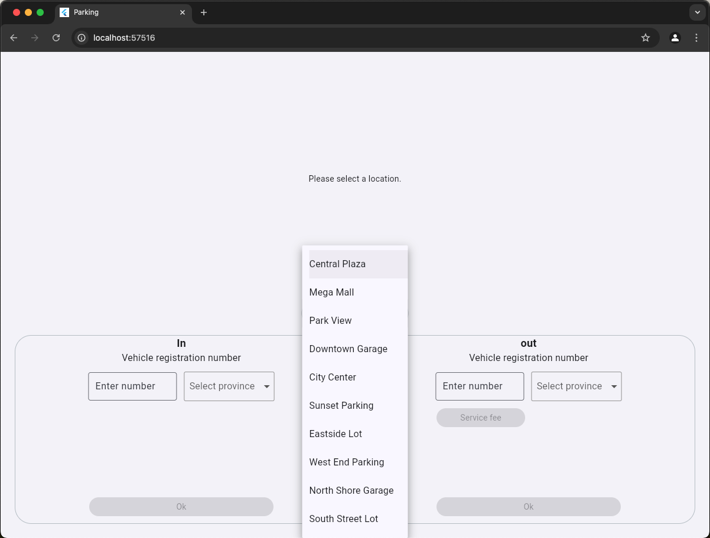
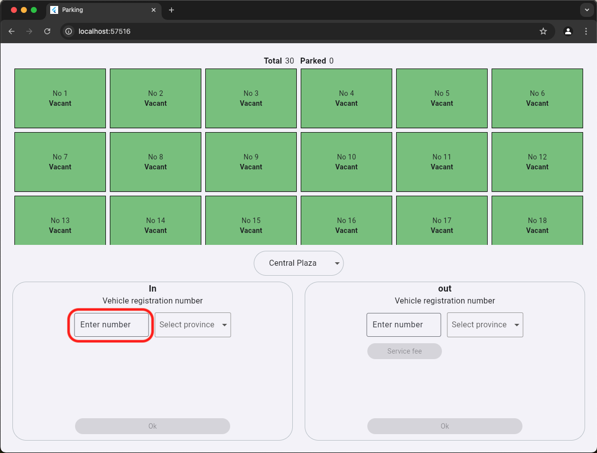

# How to run Back-End

## Run PostgreSQL
- Start docker
- Open project and open terminal
```frontend
docker-compose -f dev.yml up
```
## Run parking-backend
- Open new terminal
```frontend
python3 -m venv .venv
pip install -r requirements.txt
python3 main.py 
```
# How to run Front-End
- Connect to the Internet
- Open new terminal
```frontend
cd parking
flutter pub get
flutter run -d chrome
```
# How to use the program
- Click dropdown
<div align="center">
  
</div>
- Select location
<div align="center">
  
</div>
<div align="center">
  
</div>
