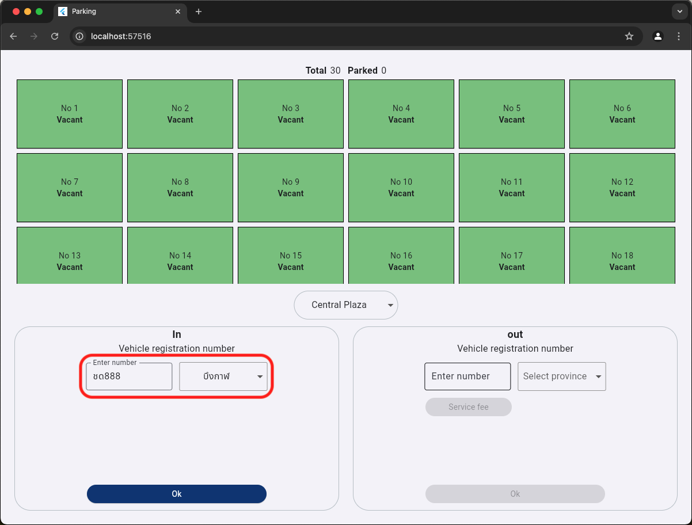

# How to run Back-End

## Run PostgreSQL
- Start docker
- Open project and open terminal
```frontend
docker-compose -f dev.yml up
```
## Run parking-backend
- Open new terminal
```frontend
python3 -m venv .venv
pip install -r requirements.txt
python3 main.py 
```
> **Note:** my Python version use v3.13.0

## API
- Get location
```frontend
curl --location 'http://127.0.0.1:5000/parking/location'
```
- Enter the parking lot
```frontend
curl --location 'http://127.0.0.1:5000/parking/transaction' \
--header 'Content-Type: application/json' \
--data '{
    "location_id": "bed736de-62ed-4962-881e-cbff61e08fe4",
    "license_plate": "ชด888:บึงกาฬ",
    "type": "on"
}'
```

- Get service fee
```frontend
curl --location 'http://127.0.0.1:5000/parking/service-fee' \
--header 'Content-Type: application/json' \
--data '{
    "location_id": "bed736de-62ed-4962-881e-cbff61e08fe4",
    "license_plate": "ชด888:บึงกาฬ"
}'
```
- Exit the parking lot
```frontend
curl --location 'http://127.0.0.1:5000/parking/transaction' \
--header 'Content-Type: application/json' \
--data '{
    "location_id": "bed736de-62ed-4962-881e-cbff61e08fe4",
    "transaction_id": "0a0d4f28-0517-447a-bc86-956db3b8b4af",
    "license_plate": "ชด888:บึงกาฬ",
    "type": "out"
}'
```

# How to run Front-End
- Connect to the Internet
- Open new terminal
```frontend
cd parking
flutter pub get
flutter run -d chrome
```
> **Note:** my Flutter version use v3.24.3

# How to use the program
## Enter the parking lot
- Click dropdown
<div align="center">
  
</div>

- Select location
<div align="center">
  
</div>

- Enter the vehicle registration number
<div align="center">
  
</div>

- Click Ok
<div align="center">
  
</div>
<div align="center">
  
</div>

## Exit the parking lot
- Enter the vehicle registration number
<div align="center">
  
</div>

- Click Service fee
<div align="center">
  
</div>

- Click Ok
<div align="center">
  
</div>
<div align="center">
  
</div>
